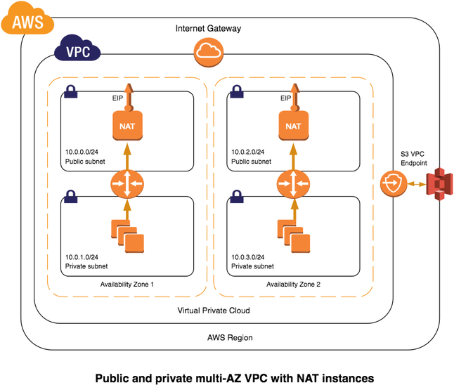

# VPC [ Virtual Private Compute ]

A virtual private cloud (VPC) is a virtual network dedicated to your AWS account. It is logically isolated from other virtual networks in the AWS Cloud

- CIDR/IP Address [Classless Inter-Domain Routing]
- Subnets : A subnet is a range of IP addresses in your VPC.
- IGW : An internet gateway is a horizontally scaled, redundant, and highly available VPC component that allows communication between instances in your VPC and the internet.
- Route Tables : A route table contains a set of rules, called routes, that are used to determine where network traffic is directed.
- Routing Rules :
  - Directed Route to the Next Hub
- NAT GW : You can use a NAT device to enable instances in a private subnet to connect to the Internet
- Security Groups
- NACL : Rules for Complete VPC
- EIP : Elastic IP , Static Public IP
- PublicIP : Dynamic Public IP it changes
- PrivateIP : Private IP that belings to VPC cidr
- DHCP: Provides IP, Time and Domain to the ec2 instances.
- DNS:
- VPC Peering:
- VPC Endpoints
