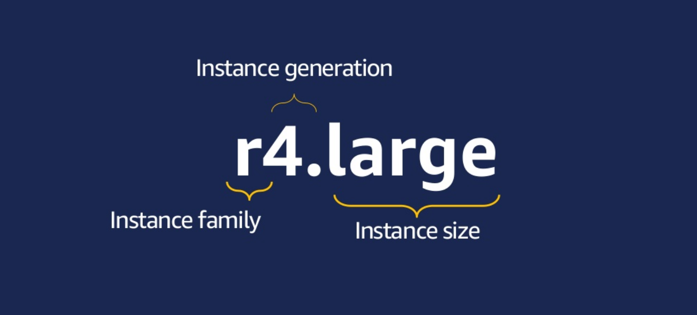

# EC2

- Virtual computing environments, known as instances
- Preconfigured templates for your instances, known as Amazon Machine Images (AMIs), that package the bits you need for your server (including the operating system and additional software)
- Various configurations of CPU, memory, storage, and networking capacity for your instances, known as instance types
  - 
- Secure login information for your instances using key pairs (AWS stores the public key, and you store the private key in a secure place)
- Storage volumes for temporary data that's deleted when you stop or terminate your instance, known as instance store volumes
- Persistent storage volumes for your data using Amazon Elastic Block Store (Amazon EBS), known as Amazon EBS volumes
- Multiple physical locations for your resources, such as instances and Amazon EBS volumes, known as regions and Availability Zones
- A firewall that enables you to specify the protocols, ports, and source IP ranges that can reach your instances using security groups
- Static IPv4 addresses for dynamic cloud computing, known as Elastic IP addresses
- Metadata, known as tags, that you can create and assign to your Amazon EC2 resources
- Virtual networks you can create that are logically isolated from the rest of the AWS cloud, and that you can optionally connect to your own network, known as virtual private clouds (VPCs)

###

### Instance Type

